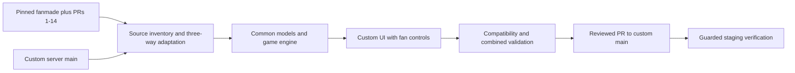

# Implementation plan

## Approved baseline and delivery
The user's approved plan and `spec.md` are authoritative. One owned branch, `codex/fanmade-full-port`, based on pinned custom `origin/main`; final hosting PR into `main`. Execute sequentially. Read project/source rules and this specification before reconciliation or lifecycle operations. Source remains pinned; refresh target before final delivery and revalidate any concurrent drift.

## Architecture
Retain the existing common/server/client separation. Expand common game configuration and wire/save models additively. Port the source server dependency closure (registries, cards, engine/deferred actions, boards and libraries) using common-ancestor reconciliation. Preserve target custom contracts rather than adding a parallel game engine. Integrate source widgets into the target component layout; the target owns application shell, admin/release controls and logging.

## Work packages
1. WP01: Compose pinned source PRs into an isolated reference, classify source file inventory and record target conflict boundaries. Validate source corrections and preserve provenance. This establishes the comparison oracle, not target acceptance.
2. WP02: Reconcile common/server mechanics and source server tests. Own registries, twelve module implementations, shared effects, board/card codecs and library routes. Preserve target protocol, saves and shadow/replay fields. Validate server build/tests; document any client work deliberately pending WP03.
3. WP03: Integrate needed client controls, creation settings, new renderer assets and styles while retaining target layout and improvements. Include latest policy popup. Validate client types/tests/build and browser smoke.
4. WP04: Validate backward save/API compatibility, disabled-module parity, input sequencing and advisor boundary. Add focused failing reproductions and fix confirmed defects from integration. Complete source ledger classification; source stubs remain explicitly listed.
5. WP05: Run combined Node 22 checks and bounded scenario matrix, focused review, final PR verification/merge, and allowed staging procedure. Preserve exact artifact/SHA evidence. Mission ends at verified staging; production is excluded.

## Reconciliation policy
- Source-only gameplay/support files can be imported with provenance and tests; inspect executable server/library inputs before exposing routes.
- Shared paths require three-way review, including cleanly applied hunks. Resolve intentional target UI differences toward target layout while retaining fan controls. Preserve target request handling, save/replay/undo and custom endpoints.
- Keep target deployment/governance/CI and dependency baseline; add or update dependencies only if required by transferred behavior and verified, not because fanmade has newer versions.
- Exclude unrelated upstream/localization/tooling drift only with an explicit inventory disposition; do not use that category for implemented mechanics.
- Confirmed bugs require reproduction and regression verification. Disputed rules/balance stop the affected decision, not unrelated authorized work.

## Validation and delivery gates
Use fresh isolated dependencies and Node 22. Run module-focused tests during transfer, then full lint/build/test compilation/server/client checks. Old saves lacking new fields must load and retain target-only state; fan deferred choices must survive save/resume. Test each module plus supported combinations and disabled parity. Browser evidence covers setup, boards, new inputs and 390px layouts. Existing advisor requests must remain compatible; unsupported new mechanics cannot pretend to be supported.

Before merge verify exact remote head, required CI, review blockers and authoritative base. Before staging follow workspace release rules: clean exact origin/main source, snapshots, lock and concurrent-drift checks, post-deploy UI/API verification. No live DB import or production mutation. Keep pending acceptance criteria open when an external gate blocks delivery.
