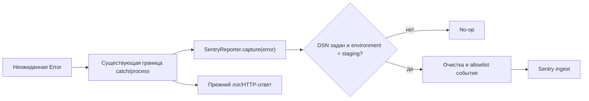

# План реализации: безопасная наблюдаемость Sentry на staging

**Ветка**: `codex/tm-sentry-staging-observability`  
**Дата**: 2026-08-11  
**Спецификация**: [spec.md](./spec.md)

## Краткое решение

Добавить один серверный шлюз диагностических событий с узким методом `capture(error)`. Шлюз включается только при сочетании `SENTRY_DSN`, точного `SENTRY_ENVIRONMENT=staging` и валидного build head, вручную отправляет исключения через `@sentry/node` и перед отправкой перестраивает событие по строгому списку разрешённых полей. Точки вызова ограничиваются существующими границами неожиданных ошибок: необработанное исключение процесса, внешний catch `processRequest` и неожиданные сбои `PlayerInput`, включая ошибку undo до её преобразования в `InputError`. Исходные message/raw stack не отправляются; ожидаемые `AppError` и `InputError` остаются вне Sentry.

## Technical Context

**Language/Version**: TypeScript 6.0, Node.js 22.x, CommonJS output  
**Primary Dependencies**: встроенный `http`/`https`, существующий маршрутизатор Terraforming Mars, новый `@sentry/node` 10.70.0  
**Storage**: без изменений; диагностические события не сохраняются в БД приложения  
**Testing**: Mocha 11, Chai 6, существующие HTTP mocks; тесты сначала, затем реализация  
**Target Platform**: Linux staging-сервер, сборка и проверки также воспроизводятся на Windows  
**Project Type**: монолитное web-приложение с Node.js backend и Vue frontend; меняется только backend  
**Performance Goals**: захват ошибки не блокирует HTTP-ответ и не добавляет сетевой работы в штатный успешный путь  
**Constraints**: fail-closed activation; без raw message/stack, request/response context, PII, breadcrumbs и tracing; без изменения HTTP/gameplay; production и deploy вне объёма
**Scale/Scope**: один новый серверный модуль, пять существующих точек ошибок, три профильных набора тестов, три артефакта карты кода

## Проверка принципов

- **Разделение ответственности**: Sentry SDK и очистка события инкапсулируются в одном серверном шлюзе; маршруты знают только о `capture(error)`.
- **Локальность изменения**: клиент, БД, игровые модели, публичные API и deploy-скрипты не меняются.
- **Проверяемые решения**: активация, allowlist события, исключение ожидаемых ошибок и сохранение ответов закреплены тестами.
- **Test-first**: сначала добавляются падающие проверки privacy/config/call sites, затем минимальная реализация.
- **Синхронизация документации**: карта кода регенерируется из актуальной task-ветки и включает новый диагностический шлюз, его callers и тесты.
- **Charter**: project-local charter отсутствует; применены встроенные требования целостности архитектуры, локальности, тестов и актуальности документации. Нарушений нет.

## Архитектура и поток



Шлюз не принимает `Request`, `Response`, `Context`, player или game. Это делает передачу тел, headers, cookies, query, IP и игровых идентификаторов невозможной через его публичный контракт. SDK запускается без default integrations, OpenTelemetry setup/loader hooks, breadcrumbs, tracing, logs и metrics; все категории `dataCollection` явно выключены. Финальный `beforeSend` заново строит событие: исходные `Error.message` и raw stack отбрасываются, тип сводится к закрытому allowlist встроенных категорий, а frames содержат только project-relative filename, безопасное имя функции и числовые координаты.

## Структура изменений

```text
package.json
package-lock.json
src/server/server.ts
src/server/server/requestProcessor.ts
src/server/server/SentryReporter.ts           # новый privacy boundary
src/server/routes/PlayerInput.ts
tests/server/server/SentryReporter.spec.ts     # новый config/privacy contract
tests/server/requestProcessor.spec.ts
tests/routes/PlayerInput.spec.ts
docs/codemap/codemap.html
docs/codemap/codemap.json
docs/codemap/codemap.lock
```

**Решение по структуре**: новый модуль располагается рядом с серверной инфраструктурой и не проникает в игровые доменные классы. Текущие catch-границы получают один best-effort вызов перед прежней обработкой ошибки.

## Последовательность реализации

1. В task-owned worktree восстановить актуальный пакет `docs/codemap/codemap.*` из текущего дерева, используя прежнюю схему только как формат, а текущий код — как единственный источник evidence.
2. Добавить тесты конфигурации и privacy-allowlist шлюза, включая явные запрещённые данные и неизвестный throwable.
3. Добавить тесты вызова только во внешнем catch `processRequest` и в трёх неожиданных путях `PlayerInput` (получение игрока, undo до преобразования, основной input catch); отдельно доказать нулевой вызов для исходных `AppError`/`InputError` и malformed JSON, единичный capture на путь и неизменные ответы.
4. Установить точную текущую версию `@sentry/node`, реализовать fail-closed шлюз и подключить его к пяти точкам ошибок с однозначным ownership.
5. Обновить карту кода уже по итоговому дереву, затем выполнить профильные и общие проверки.

## Implementation Concern Map

### IC-01 — Конфигурация и privacy boundary

- **Purpose**: безопасно включать SDK только на staging и формировать минимальное событие без запрещённых данных.
- **Relevant requirements**: FR-001, FR-005, FR-007, NFR-001—NFR-004.
- **Affected surfaces**: `package.json`, `package-lock.json`, новый `src/server/server/SentryReporter.ts`, новый профильный тест.
- **Sequencing/depends-on**: none.
- **Risks**: SDK по умолчанию включает HTTP request isolation и широкие категории `dataCollection`, а исходные message/stack могут содержать пользовательские фрагменты; поэтому default integrations, OpenTelemetry hooks и все категории сбора выключаются, `beforeSend` не переносит raw strings и строит итог по закрытому allowlist.

### IC-02 — Границы неожиданных ошибок

- **Purpose**: получить ошибки, которые сейчас только логируются или преобразуются в HTTP-ответ, не меняя их существующее поведение.
- **Relevant requirements**: FR-002—FR-004, FR-006, FR-007.
- **Affected surfaces**: `src/server/server.ts`, `src/server/server/requestProcessor.ts`, `src/server/routes/PlayerInput.ts` и их тесты. В request flow capture принадлежит только `processRequest`; `requestHandler` сохраняет прежний 500 без второго capture. Отдельный `unhandledRejection` listener не добавляется.
- **Sequencing/depends-on**: IC-01.
- **Risks**: двойная отправка, потеря исходной undo-ошибки и ошибочная классификация malformed JSON; ownership закреплён за одной catch-границей на путь, undo capture выполняется до преобразования, а parse failure помечается локально без замены исходной ошибки/ответа.

### IC-03 — Поведенческие и privacy-тесты

- **Purpose**: доказать независимым oracle активацию, состав события, классификацию ошибок и неизменность HTTP-ответов.
- **Relevant requirements**: все FR, NFR-004.
- **Affected surfaces**: `tests/server/server/SentryReporter.spec.ts`, `tests/server/requestProcessor.spec.ts`, `tests/routes/PlayerInput.spec.ts`.
- **Sequencing/depends-on**: none для тестовых контрактов; выполнение после IC-01 и IC-02.
- **Risks**: mock client может обойти реальный SDK pipeline; тест использует настоящий configured client с fake transport, разбирает финальный envelope рекурсивно по запрещённым ключам и sentinel-значениям и отдельно проверяет observable HTTP output.

### IC-04 — Карта кода и итоговые gates

- **Purpose**: восстановить обязательную карту до изменения модуля и оставить её синхронизированной с итоговым графом callers/tests.
- **Relevant requirements**: NFR-005, C-001—C-003.
- **Affected surfaces**: `docs/codemap/codemap.html`, `docs/codemap/codemap.json`, `docs/codemap/codemap.lock`.
- **Sequencing/depends-on**: baseline до IC-02; финальная регенерация после IC-01—IC-03.
- **Risks**: прежняя remote-ветка карты устарела относительно текущего `origin/main`; её содержимое нельзя переносить как актуальное evidence.

## Проверки

- Профильный Mocha-набор для шлюза, request processor и `PlayerInput`, включая valid/`n/a` release, получение игрока, undo-преобразование, malformed JSON и ровно один capture.
- `npm run build:tests`.
- `npm run lint:server`.
- `npm run build:server` и затем полный `npm run build`.
- JSON parse и внутренние ссылки карты кода; `codemap.lock` соответствует итоговому commit/tree fingerprint и не сообщает скрытых изменённых модулей.
- `git diff --check` и точная проверка scope diff.

## Delivery gates

Локальные commits в task-owned ветке разрешены после проверок. Push, PR, merge, конфигурация `SENTRY_DSN` на сервере, staging deploy, реальная отправка тестового события и любые production-действия остаются отдельными gates и в этот пакет не входят.

## Complexity Tracking

Нарушений принципов и оправдываемой дополнительной сложности нет. Отдельный шлюз нужен как единственная контролируемая граница внешней отправки; более широкая система telemetry или общий event bus не вводятся.
